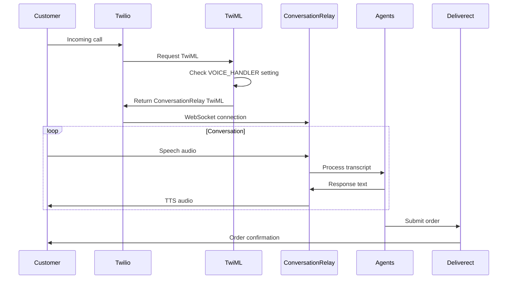

# RedBarSushiAI Current Architecture

## Overview

RedBarSushiAI is a **FastAPI-based** AI voice ordering system that uses a **multi-agent architecture** with **ConversationRelay** for voice communication. The system is fully async and designed for production scalability.

## Directory Structure

```
app/
├── api/                      # API endpoints
│   ├── __init__.py          # Main API router registration
│   ├── conversation_relay/   # ConversationRelay WebSocket handler
│   │   ├── handler.py       # WebSocket connection management
│   │   ├── audio.py         # Audio processing (STT/TTS)
│   │   ├── twiml.py         # TwiML generation
│   │   └── models.py        # Pydantic models
│   ├── voice/               # Voice handling utilities
│   │   ├── twiml.py         # TwiML generator with VOICE_HANDLER switch
│   │   └── testing.py       # Voice testing endpoints
│   ├── menu/                # Menu API endpoints
│   │   ├── items.py         # Menu item CRUD
│   │   ├── categories.py    # Category management
│   │   ├── modifiers.py     # Modifier operations
│   │   └── search.py        # Menu search functionality
│   └── order/               # Order API endpoints
│       ├── take_order.py    # Order creation
│       ├── checkout.py      # Order submission to Deliverect
│       ├── confirmation.py  # Order confirmation
│       └── status.py        # Order status tracking
│
├── agents/                  # Multi-agent system
│   ├── base_async.py       # Base agent class
│   ├── frontline_async.py  # Main conversation coordinator
│   ├── menu_async.py       # Menu inquiry specialist
│   ├── cart_async.py       # Order management specialist
│   ├── guardrail_async.py  # Order validation specialist
│   ├── fulfillment_async.py # Order submission specialist
│   ├── escalation_async.py # Human handoff specialist
│   └── factory_async.py    # Agent instantiation factory
│
├── models/                  # Database models (SQLAlchemy 2.0)
│   ├── base_async.py       # Base model with async support
│   ├── menu_async.py       # Menu models (categories, items, modifiers)
│   ├── order_async.py      # Order models
│   └── location_async.py   # Location/store models
│
├── utils/                   # Shared utilities
│   ├── agent_orchestration_async.py  # Agent coordination
│   ├── fsm_async.py                 # Finite State Machine
│   ├── conversation_store_async.py  # Redis-based state storage
│   ├── menu_matcher_db_async.py     # Menu item matching
│   ├── deliverect_async.py          # Deliverect API integration
│   └── text_normalization.py        # Text processing for TTS
│
├── config.py               # Application configuration
├── main.py                 # FastAPI application entry point
├── db_async.py            # Async database setup
└── dependencies.py        # Dependency injection
```

## How It Works

### 1. Voice Call Flow



### 2. ConversationRelay Integration

**Endpoint**: `/api/conversation-relay` (WebSocket)

**Features**:
- Bidirectional audio streaming using PCMU format
- Built-in barge-in detection
- Mark events for tracking TTS playback
- Direct integration with OpenAI Whisper (STT) and TTS APIs

**Handler Flow**:
1. Twilio connects via WebSocket
2. Handler receives `start` event with call metadata
3. Audio streams in `media` events
4. Handler processes audio → transcript → agent → response → TTS
5. Mark events track when TTS completes

### 3. Multi-Agent Architecture

**Agent Roles**:

1. **Frontline Agent** (`frontline_async.py`)
   - Main conversation coordinator
   - Delegates to specialized agents
   - Manages conversation flow

2. **Menu Agent** (`menu_async.py`)
   - Handles menu inquiries
   - Searches for items
   - Explains options and availability

3. **Cart Agent** (`cart_async.py`)
   - Manages order items
   - Handles modifications
   - Tracks quantities

4. **Guardrail Agent** (`guardrail_async.py`)
   - Validates orders
   - Enforces business rules
   - Checks modifier limits

5. **Fulfillment Agent** (`fulfillment_async.py`)
   - Submits orders to Deliverect
   - Handles payment processing
   - Confirms order details

6. **Escalation Agent** (`escalation_async.py`)
   - Manages handoff to human staff
   - Handles complex situations

### 4. Finite State Machine (FSM)

**States**:
```python
class ConversationState(Enum):
    GREETING = "greeting"
    MAIN_MENU = "main_menu"
    ORDERING = "ordering"
    VALIDATION = "validation"
    CONFIRMATION = "confirmation"
    FULFILLMENT = "fulfillment"
    COMPLETION = "completion"
    FOLLOW_UP = "follow_up"
    ERROR = "error"
    ESCALATION = "escalation"
```

**State Transitions**:
- GREETING → MAIN_MENU (after introduction)
- MAIN_MENU → ORDERING (customer wants to order)
- ORDERING → VALIDATION (items added to cart)
- VALIDATION → CONFIRMATION (order validated)
- CONFIRMATION → FULFILLMENT (customer confirms)
- FULFILLMENT → COMPLETION (order submitted)

### 5. Database Architecture

**Async SQLAlchemy with PostgreSQL**:

```python
# Menu Structure
MenuCategory
├── MenuItem
│   ├── plu (critical for POS)
│   ├── price
│   └── modifiers → MenuModifier
└── MenuModifierGroup
    └── MenuModifier
        └── plu (critical for POS)

# Order Structure  
Order
├── OrderItem
│   ├── menu_item_plu
│   └── OrderItemModifier
│       └── modifier_plu
└── delivery details
```

### 6. Key Features

**Menu Matching**:
- Exact PLU matching
- Fuzzy string matching
- AI-powered semantic matching
- Natural language variants (e.g., "California Roll" → "Cali Roll")

**Order Processing**:
- Real-time validation
- Modifier limit enforcement
- Availability checking
- Price calculation

**State Management**:
- Redis for conversation state
- Session persistence
- Distributed locking

**Integration Points**:
- Twilio for voice
- OpenAI for AI processing
- Deliverect for POS
- Stripe for payments (optional)

## Configuration

**Environment Variables**:
```bash
# Voice handling mode
VOICE_HANDLER=conversation_relay  # or "media_streams"

# API Keys
OPENAI_API_KEY=sk-...
TWILIO_ACCOUNT_SID=AC...
TWILIO_AUTH_TOKEN=...
DELIVERECT_API_KEY=...

# Database
DATABASE_URL=postgresql+asyncpg://...
REDIS_URL=redis://...

# Application
FASTAPI_ENV=production
LOG_LEVEL=INFO
```

## API Endpoints

### HTTP Endpoints
- `POST /voice/` - Twilio webhook for incoming calls
- `GET /menu/items` - List menu items
- `POST /order/checkout` - Submit order
- `GET /order/{order_id}/status` - Check order status

### WebSocket Endpoints
- `/api/conversation-relay` - ConversationRelay voice handling

### Testing Endpoints
- `POST /voice/test/process` - Test voice input processing
- `POST /voice/test/tool` - Test agent tool execution
- `GET /voice/test/fsm/{call_sid}` - Get FSM state

## Deployment

The application is deployed on Render with:
- Docker containerization
- Automatic scaling
- PostgreSQL and Redis managed services
- Environment-based configuration
- GitHub Actions CI/CD

## Summary

RedBarSushiAI is a production-ready voice ordering system that:
1. Uses **ConversationRelay** for low-latency voice communication
2. Employs a **multi-agent architecture** for specialized task handling
3. Manages conversation flow with a **Finite State Machine**
4. Integrates seamlessly with **Twilio**, **OpenAI**, and **Deliverect**
5. Provides **async performance** throughout the stack
6. Maintains **clean separation** between voice handling and business logic